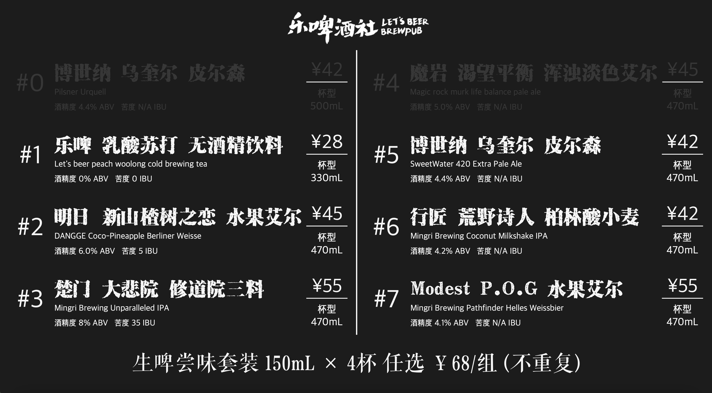

# Tap List on TV

Dragon Head 的一部分，用于将在枪状态的酒显示在电视机端的酒单上
使用PySide6实现的GUI


## 开发环境

```shell
virtualenv venv
source venv/bin/activate
deactivate
```

## 更新requirements.txt

```shell
pip freeze >requirements.txt
pip install -r requirements.txt
```
